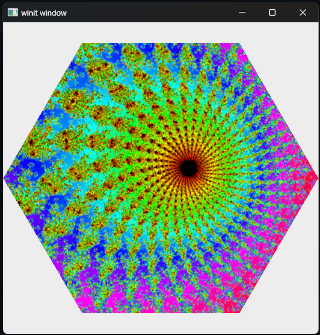

# box-render

## Current State

Simple 2D Texture [2023-07-09]


Use the mouse wheel to lighten or darken the background.

Use    
Use the &uarr; &darr; or `W` `S` keys to move the camera closer or further away from the object and &larr; &rarr; or `A` `D` to rotate the camera around the Y axis.
 
## Running on the Desktop

```ps1
> cargo run --package box-render
```

## Running in the Browser

You can run this project using the legacy WebGL bindings or the new WebGPU 
bindings (with browsers that support them). We use the run-wasm model to 
simplify running in the browser with WASM.

You must set the ```web_sys_unstable_apis``` flag to run with native WebGPU in the browser

```ps1
> $Env:RUSTFLAGS="--cfg=web_sys_unstable_apis"
```

You can then run the WASM project with one of the following commands depending
 on whether you are running WebGPU or WebGL backends.

 WebGPU
```ps1
> cargo run-wasm --package box-render --bin render-app
```

WebGL
```ps1
> cargo run-wasm --package box-render --features webgl --bin render-app
```

